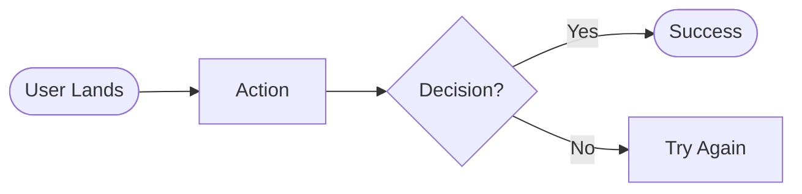
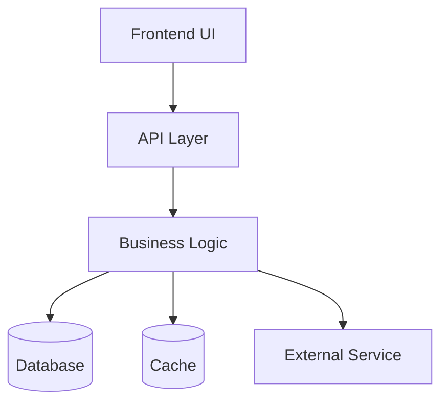

# 🎯 Feature Spec: [Feature Name]

> **Status:** 🟡 Draft / 🔵 In Review / ✅ Approved / 🚧 In Progress / ✨ Done / ❌ Rejected
> **Target Release:** v1.5
> **Estimated Effort:** 3-5 days
> **Risk Level:** Low / Medium / High

---

## 📋 EXECUTIVE SUMMARY

<!-- 2-3 ประโยค: ทำอะไร เพื่อใคร แก้ปัญหาอะไร -->

---

## 🎯 PROBLEM STATEMENT

### The Problem

<!-- ปัญหาที่ feature นี้แก้คืออะไร? -->

### Current State

<!-- ตอนนี้ user ทำยังไง? อะไรที่ไม่ดี? -->

### Pain Points

1.
2.
3.

### Why Now?

<!-- ทำไมต้องทำตอนนี้? -->

---

## 👥 USERS & STAKEHOLDERS

### Primary Users

<!-- ใครจะใช้ feature นี้? -->

- **Role:**
- **Persona:**
- **Frequency of use:** Daily / Weekly / Monthly / Occasional

### Secondary Users

<!-- มีใครได้รับผลกระทบทางอ้อม? -->

### Stakeholders

<!-- ใครต้องอนุมัติ? ใครต้องรู้? -->

- **Decision maker:**
- **Subject matter expert:**
- **Reviewer:**

---

## 💡 PROPOSED SOLUTION

### Overview

<!-- คิดจะทำยังไง? high-level -->

### User Stories

#### Story 1: [Title]

**As a** [user role]  
**I want to** [action]  
**So that** [benefit]

**Acceptance Criteria:**

- [ ] Given X, When Y, Then Z
- [ ] Given X, When Y, Then Z

#### Story 2: [Title]

**As a** [user role]  
**I want to** [action]  
**So that** [benefit]

**Acceptance Criteria:**

- [ ]
- [ ]

### User Flow

<!-- ขั้นตอนการใช้งาน -->



### Wireframes / Mockups

<!-- ลิงก์ Figma หรือแนบรูป -->

- [Figma Design](link)
- [Wireframe v1](link)

---

## 🏗️ TECHNICAL DESIGN

### Architecture Overview



### Component Breakdown

#### Frontend

- **New components:**
  - `ComponentA` — purpose
  - `ComponentB` — purpose
- **Modified components:**
  - `ExistingComponent` — what changes

#### Backend

- **New endpoints:**
  - `POST /api/v1/feature` — purpose
  - `GET /api/v1/feature/:id` — purpose
- **New services:**
  - `FeatureService` — responsibility

#### Database

- **New tables:**
  - `feature_table` — purpose
- **Modified tables:**
  - `existing_table` — what changes
- **New indexes:**
  - `idx_xxx` — query pattern

### API Design

#### Endpoint 1

```http
POST /api/v1/feature
Content-Type: application/json
Authorization: Bearer <token>

{
  "field1": "value",
  "field2": 123
}
```

**Response:**

```json
{
  "id": "abc123",
  "field1": "value",
  "createdAt": "2026-05-13T10:00:00Z"
}
```

**Error Codes:**
| Code | Reason |
|------|--------|
| 400 | Invalid input |
| 401 | Unauthorized |
| 409 | Conflict |

### Data Model

```typescript
interface FeatureData {
  id: string; // UUID
  userId: string; // FK to User
  status: "pending" | "active" | "completed";
  data: {
    field1: string;
    field2: number;
  };
  createdAt: Date;
  updatedAt: Date;
}
```

### State Management

## <!-- ถ้ามี complex state -->

## 🎨 DESIGN DECISIONS

### Decision 1: [Topic]

**Question:**

**Options Considered:**

1. **Option A:** Pros / Cons
2. **Option B:** Pros / Cons
3. **Option C:** Pros / Cons

**Decision:** Option A

**Rationale:**

**Trade-offs:**

### Decision 2: [Topic]

(same structure)

---

## 🚨 RISKS & MITIGATIONS

### Technical Risks

| Risk   | Likelihood   | Impact       | Mitigation      |
| ------ | ------------ | ------------ | --------------- |
| Risk 1 | Low/Med/High | Low/Med/High | How to mitigate |
| Risk 2 |              |              |                 |

### Business Risks

| Risk                | Likelihood | Impact | Mitigation |
| ------------------- | ---------- | ------ | ---------- |
| User adoption       |            |        |            |
| Competitor response |            |        |            |

### Security & Privacy Risks

-
- ***

## 🧪 TESTING STRATEGY

### Test Coverage

- [ ] Unit tests for business logic
- [ ] Integration tests for API
- [ ] E2E tests for critical paths
- [ ] Performance tests
- [ ] Security tests
- [ ] Accessibility tests

### Test Scenarios

#### Happy Paths

1.
2.

#### Edge Cases

1. Empty input
2. Maximum input
3. Concurrent requests
4.

#### Error Cases

1. Invalid input
2. Unauthorized access
3. Resource not found
4.

---

## 📊 SUCCESS METRICS

### How We Measure Success

#### Quantitative

- **Metric 1:** Target value
- **Metric 2:** Target value
- **Metric 3:** Target value

#### Qualitative

- User feedback score
- Support ticket volume
-

### Monitoring & Analytics

- [ ] Analytics events defined
- [ ] Dashboard created
- [ ] Alerts configured

---

## 🚀 ROLLOUT PLAN

### Phase 1: Foundation (Week 1)

- [ ] Database schema
- [ ] Backend API
- [ ] Basic tests

### Phase 2: UI (Week 2)

- [ ] Frontend components
- [ ] Integration with API
- [ ] Comprehensive tests

### Phase 3: Polish (Week 3)

- [ ] Edge cases
- [ ] Performance optimization
- [ ] Documentation

### Feature Flag Strategy

- [ ] Behind feature flag
- [ ] Gradual rollout: 5% → 25% → 50% → 100%
- [ ] Kill switch ready

### Communication Plan

- [ ] Internal announcement (team)
- [ ] Beta tester notification
- [ ] Public release notes
- [ ] Help docs published

---

## 📚 DOCUMENTATION NEEDS

- [ ] User guide / tutorial
- [ ] API documentation
- [ ] Internal architecture doc
- [ ] Runbook for operations
- [ ] Migration guide (if breaking)

---

## ❓ OPEN QUESTIONS

<!-- คำถามที่ยังไม่มีคำตอบ -->

1. **Q:**
   **Needs answer from:**
   **By when:**

2. **Q:**
   **Needs answer from:**
   **By when:**

---

## ✅ APPROVAL CHECKLIST

### Pre-Implementation

- [ ] Technical design reviewed
- [ ] Security review completed
- [ ] Performance considerations addressed
- [ ] Database design approved
- [ ] API contract agreed
- [ ] Timeline realistic
- [ ] Resources available

### Stakeholder Sign-off

- [ ] Product owner:
- [ ] Engineering lead:
- [ ] Design:
- [ ] Security:

---

## 🔄 REVISION HISTORY

| Date       | Author | Changes       |
| ---------- | ------ | ------------- |
| 2026-05-13 | [name] | Initial draft |
|            |        |               |

---

## 📎 RELATED RESOURCES

### Related Specs

- [Other Feature Spec](link)

### Related ADRs

- [ADR-001: Decision X](link)

### External References

- [Industry article](link)
- [Standards document](link)

---

**🌟 Specified with Claudy AI Team**
